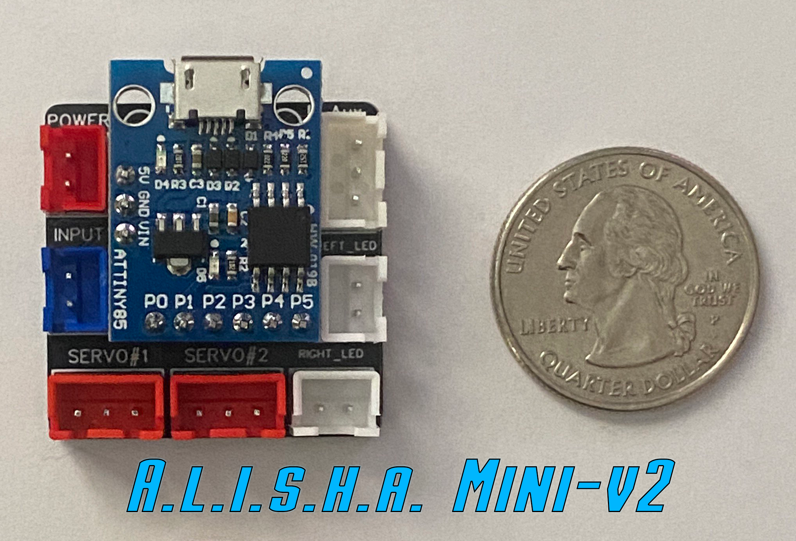
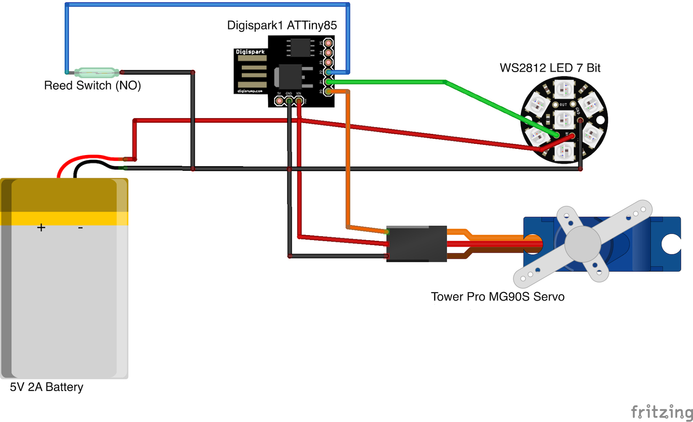

# Eye of Agamotto Servo and LED Control

The purpose of this project is to automate the features of the Eye of Agamotto. This project was created with the purpose of enabling fans like you to be able to more easily make your own automated prop. We encourage you to learn from this as well as provide feedback for us to improve upon it.  Hat tip to **[MSquared](https://www.instagram.com/ironmikecosplay/)** for the initial work on this prop!

## Follow Me

[![alt text][6.1]][6]  [![alt text][1.1]][1]  [![alt text][2.1]][2]  [![alt text][3.1]][3]   [![alt text][4.1]][4]    [![alt text][5.1]][5]

[1]: https://www.instagram.com/crashworks3d/
[2]: https://www.youtube.com/@crashworks3d?view_as=subscriber&sub_confirmation=1
[3]: https://github.com/
[4]: https://www.thingiverse.com/crashworks3d/designs
[5]: https://www.facebook.com/groups/cosplayspecialeffectsprops
[6]: https://linktr.ee/crashworks3d
[1.1]: images/instagram.png (Instagram - Crash Works 3D)
[2.1]: images/youtube.png (YouTube - Dropwire)
[3.1]: images/github.png (Github - Crash Works)
[4.1]: images/Thingiverse.png (Thingiverse - Crash Works)
[5.1]: images/facebook.png (Facebook - Crash Works)
[6.1]: images/linktree.png (Link Tree)

## Getting Started

It will be helpful but not necessary if you have a basic level of programming experience as well as a little experience programming Arduino micro controllers.  This project was created using the [Arduino IDE](https://www.arduino.cc/).  Clone or download this repository at your own risk.

You can download the 3D printable "Mechanized Eye of Agamotto" from Thingiverse:

[Thingiverse Mechanized Eye of Agamotto](https://www.thingiverse.com/thing:4970358)

**You can purchase an easy to install and use Arduino shield (ATTiny85 included) designed specifically for this project. This Board comes pre-flashed with the Crashworks code installed.**

**_A.L.I.S.H.A. Mini_ - Arduino ATTiny85 Led & Integrated Servo Actuator for 3D Eye of Agamotto**

  [A.L.I.S.H.A. Mini](https://www.ebay.com/str/crashworks3d)

### Prerequisites

* Some experience with [Arduino](https://www.arduino.cc/)

* Be sure to have the DigiSpark ATTiny85 board installed in your environment. Instructions: [DigiStump Wiki](http://digistump.com/wiki/digispark/tutorials/connecting)

* Install the [Adafruit_SoftServo](https://github.com/adafruit/Adafruit_SoftServo) library.

* Install the [OneButton](https://github.com/mathertel/OneButton) library.

* Install the [Light WS2812](https://github.com/cpldcpu/light_ws2812) library.

* An A.L.I.S.H.A. Mini board or DigiSpark ATTiny85 board

* MG90s Mini Tower Pro Servo [TODO: Link]

* WS2812 7 bit pixel jewel [TODO: Link]

* Reed switch (Normally Open) [TODO: Link]

* Magnet [TODO: Link]

* USB 5V 2A power supply [TODO: Link]

## Wiring Diagram

## Built With

* [Arduino](https://www.arduino.cc/)

## Versioning

Version Beta 1.0 (Use at your own risk) 

## Authors

* **Cranshark @ i3 Creations**

* **Dropwire**

## License

This project is licensed under the MIT License - see the [LICENSE.md](LICENSE.md) file for details

## Acknowledgments/ Hat Tip

### MSquared

Instagram: https://www.instagram.com/ironmikecosplay/

YouTube: https://www.youtube.com/channel/UC4OZClpaBAb9Tj_8G3T459A

Thingiverse: https://www.thingiverse.com/msquared94/designs

